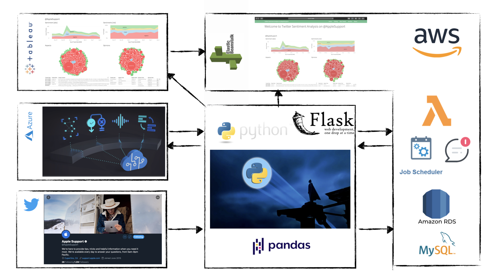
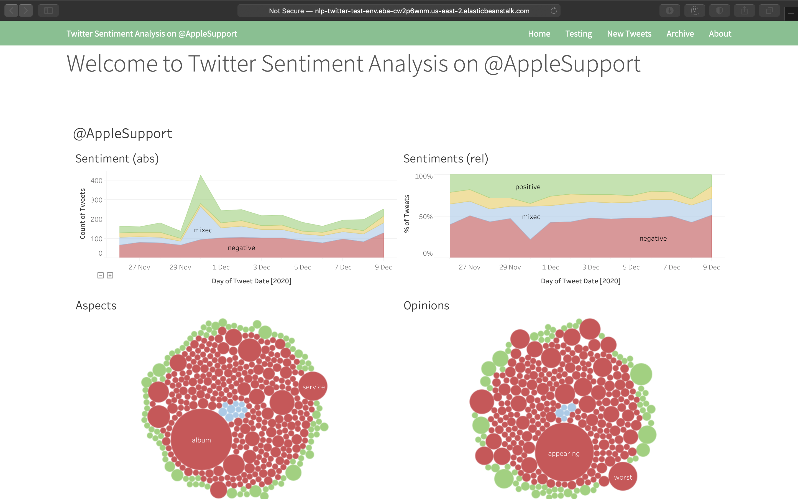
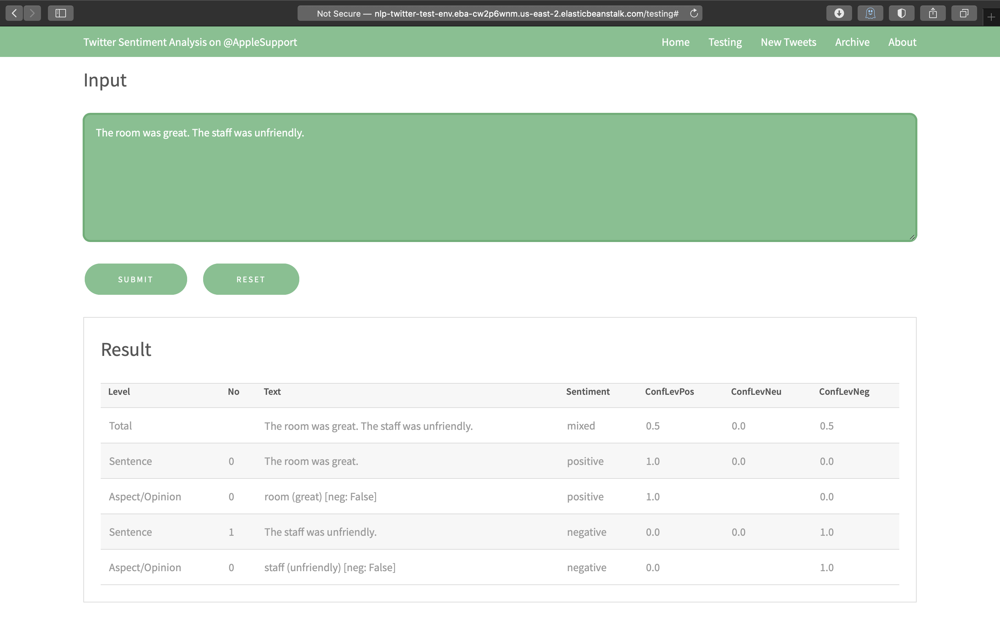
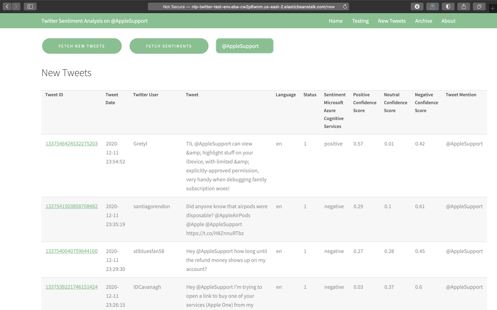
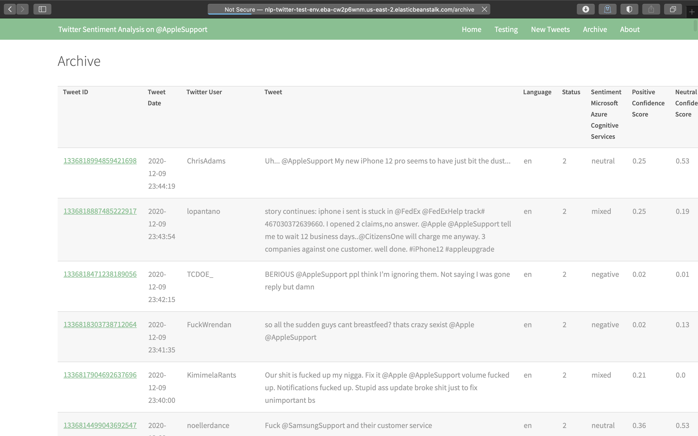

# Ironhack Final Project
Public files for my final project completed at Ironhack Data Analytics Bootcamp in December 2020.

## Overview
The idea was to build a complete pipeline:
<ul>
  <li>fetching tweets directed to a <a href="twitter.com/AppleSupport">@AppleSupport</a> via <a href="www.tweepy.org">API</a> (excluding retweets and replies);</li>
  <li>storing them on a MySQL Database on <a href="aws.amazon.com/rds">Amazon Relational Database Service (RDS)</a>;</li>
  <li>sending the tweets to <a href="azure.microsoft.com/en-us/services/cognitive-services/">Microsoft Azure Cognitive Services</a> for sentiment analysis and opinion mining via API;</li>
  <li>updating and storing the enriched data on Amazon Relational Database Service (RDS);</li>
  <li>automate the fetching with an <a href="aws.amazon.com/lambda/">AWS Lambda</a> function and sending notifications if a certain threshold is reached via <a href="aws.amazon.com/sns">Amazon</a>;</li>
  <li>the results are imported into <a href="https://public.tableau.com/views/twitter_16075212954180/AppleSupport?:language=en-GB&:display_count=y&:origin=viz_share_link">Tableau Public</a> (no direct link to SQL database possible in this version);</li>
  <li>presenting the results on a <a href="http://nlp-twitter-test-env.eba-cw2p6wnm.us-east-2.elasticbeanstalk.com">website</a> hosted on <a href="aws.amazon.com/elasticbeanstalk/">AWS Elastic Beanstalk</a> via <a href="flask.palletsprojects.com">Flask</a>.</li>
</ul>

## Pipeline

                                      
## Website

http://nlp-twitter-test-env.eba-cw2p6wnm.us-east-2.elasticbeanstalk.com 
(not available all the time due to AWS free tier limits)

Home

Testing

New Tweets

Archive

